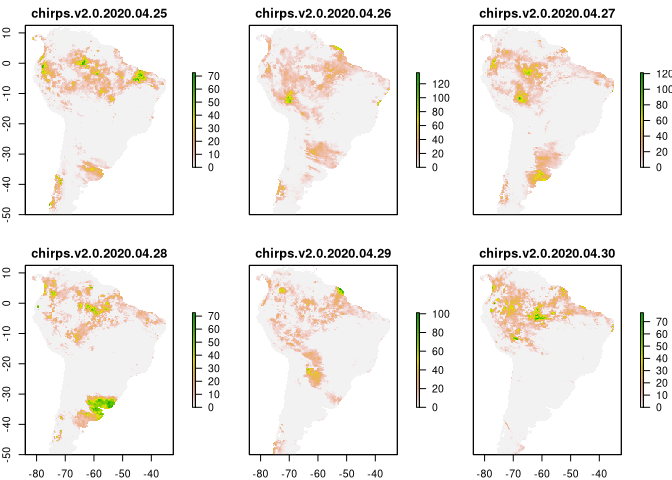

<!-- README.md is generated from README.Rmd. Please edit that file -->

# chirps

<!-- badges: start -->

[](https://www.tidyverse.org/lifecycle/#experimental)
<!-- badges: end -->

The goal of chirps is to help for the managing of CHIRPS v2
precipitation estimates.

## Installation

You can install the development version from
[GitHub](https://github.com/) with:

``` r
# install.packages("devtools")
devtools::install_github("frzambra/chirps")
```

## Example

``` r
library(chirps)
library(raster)
#> Loading required package: sp

times <- list(
  c('2019-10-01','2019-12-31'),
  c('2020-04-25','2020-04-30'))
  
# this will download 2-monthly chirps data
path <- '~/chirps/2-month' #download path

downCHIRPS(path,product= "global_2-monthly",time_span =times[[1]],
           crop_by=c('countries','chile'))
#> [1] url        name       start_date end_date   new_name  
#> <0 rows> (or 0-length row.names)

pre <- raster::stack(list.files(path,pattern = '*.tif$',full.names = TRUE))
pre[pre == -9999] <- NA
plot(pre)
```


``` r

# this will download daily chirps data
path <- '~/chirps/daily' #download path

downCHIRPS(path,product= "global_daily",time_span =times[[2]],
           crop_by=c('continent','South America'),res=.25)
#> [1] url      name     date     new_name
#> <0 rows> (or 0-length row.names)

pre <- raster::stack(list.files(path,pattern = '*.tif$',full.names = TRUE))
pre[pre == -9999] <- NA
plot(pre)
```


<!-- This is a basic example which shows you how to solve a common problem: -->

<!-- ```{r example} -->

<!-- library(chirps) -->

<!-- ## basic example code -->

<!-- ``` -->

<!-- What is special about using `README.Rmd` instead of just `README.md`? You can include R chunks like so: -->

<!-- ```{r cars} -->

<!-- summary(cars) -->

<!-- ``` -->

<!-- You'll still need to render `README.Rmd` regularly, to keep `README.md` up-to-date. -->

<!-- You can also embed plots, for example: -->

<!-- ```{r pressure, echo = FALSE} -->

<!-- plot(pressure) -->

<!-- ``` -->

<!-- In that case, don't forget to commit and push the resulting figure files, so they display on GitHub! -->
